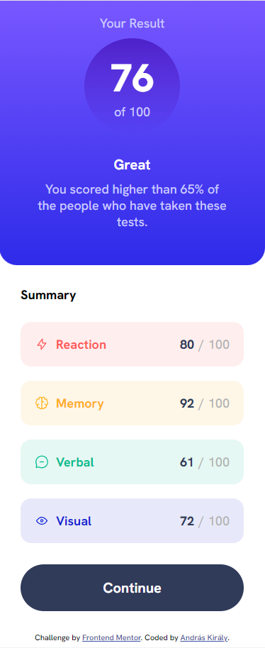
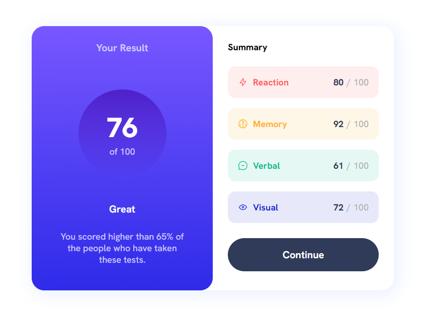

# Frontend Mentor - Results summary component solution

This is a solution to the [Results summary component challenge on Frontend Mentor](https://www.frontendmentor.io/challenges/results-summary-component-CE_K6s0maV). Frontend Mentor challenges help you improve your coding skills by building realistic projects. 

## Table of contents

- [Overview](#overview)
  - [The challenge](#the-challenge)
  - [Screenshot](#screenshot)
  - [Links](#links)
- [My process](#my-process)
  - [Built with](#built-with)
  - [What I learned](#what-i-learned)
  - [Continued development](#continued-development)
- [Author](#author)

**Note: Delete this note and update the table of contents based on what sections you keep.**

## Overview

### The challenge

Users should be able to:

- View the optimal layout for the interface depending on their device's screen size
- See hover and focus states for all interactive elements on the page

### Screenshot

### Links

- Solution URL: [Add solution URL here](https://www.frontendmentor.io/solutions/css-custom-properties-without-framewrok-2iaJcs9UPG)
- Live Site URL: [Add live site URL here](https://pr3t0r.github.io/results-summary-component-main/)

## My process

### Built with

- VSCODE
- CSS custom properties
- without framework
- Mobile-first workflow
- flexbox
- media queries
- eye sighting (no exact sizes were available except paragraphs)

### What I learned

I tried to improve on the mistakes I made in the challanges before.
Like using alt text on images, using section tags and headings corretly.

### Continued development

- class naming
- logics
- adapting to mobile-first workflow

## Author

- Frontend Mentor - [@Pr3t0r](https://www.frontendmentor.io/profile/Pr3t0r)